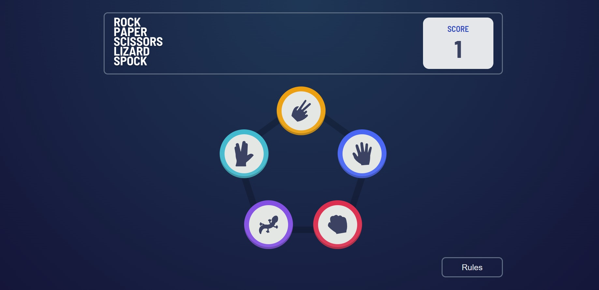

# Frontend Mentor - Rock, Paper, Scissors solution

This is a solution to the [Rock, Paper, Scissors challenge on Frontend Mentor](https://www.frontendmentor.io/challenges/rock-paper-scissors-game-pTgwgvgH). Frontend Mentor challenges help you improve your coding skills by building realistic projects. 

## Table of contents

- [Overview](#overview)
  - [The challenge](#the-challenge)
  - [Screenshot](#screenshot)
  - [Links](#links)
- [My process](#my-process)
  - [Built with](#built-with)
  - [What I learned](#what-i-learned)
  - [Continued development](#continued-development)
  - [Useful resources](#useful-resources)
- [Author](#author)

## Overview

### The challenge

Users should be able to:

- View the optimal layout for the game depending on their device's screen size
- **Bonus**: Play Rock, Paper, Scissors, Lizard, Spock against the computer _(optional)_ (I did only the bouns part 😊)
- Keep track of the score
- After each round, the user should see a small animation to indicate what happened

### Screenshot

### Links

- Solution URL: [GITHUB](https://github.com/salma247/game-react)
- Live Site URL: [LIVE](https://salma247.github.io/game-react/)

## My process

### Built with

- Semantic HTML5 markup
- CSS custom properties
- Flexbox
- Mobile-first workflow
- SCSS
- [React](https://reactjs.org/) - JS library

### What I learned

I used motion library to animate the game. I learned how to use it and how to use it with react. I also learned how to use react hooks. especially useContex and useReducer. I also learned how to use react router.

### Continued development

I want to continue learning react and improve my skills, know more about state managment and how to use it in react. I also want to learn more about animations and how to use them in react.

### Useful resources

- [Motion.js](https://motion.dev/) - This helped me with animations. I really liked this library and will use it going forward.

## Author

- LinkedIn - [Salma Ahmed](https://www.linkedin.com/in/salma-ahmed-mohammed/)
- Frontend Mentor - [@salma247](https://www.frontendmentor.io/profile/salma247)

